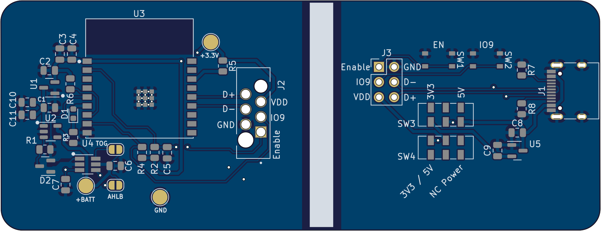
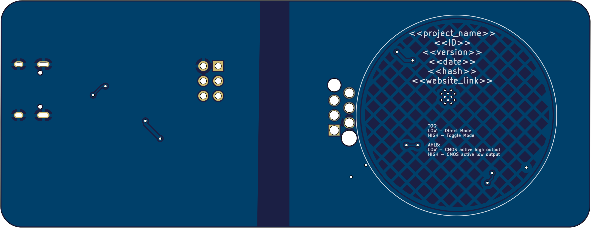

# KiCad_Template

This is a template repo for KiCAD v6 projects with 

## Todo

* ~add DRC, ERC as seperate WF~ 
* ~add DRC, ERC to release WF as blocking~
* ~add release checklist~
* order release checklist
* ~add workflow to automatically create new realease checklist and realease note file and reset the generic for the next release~
* ~Rename artefacts with project name and date?~
* Add diffrent PCB manufactures output via kibot
* ~Update to kicad6_auto:1.3.0~
* use version number for template

## Usage

hit "use this template" button
delet all unneded files in Doc folder
delet all Schematic stuff but not the text Placeholders <<...>>
delet all PCB stuff but not the text Placeholders <<...>> and the Board Edge (or the iBOM will fail). You can remodel it later.

### Workflow
If not working:
setting -> action -> general -> Workflow permissions -> Read and write permissions

## Description. 

| Font                                           | Back                                             |
|------------------------------------------------|--------------------------------------------------|
|  |  |
